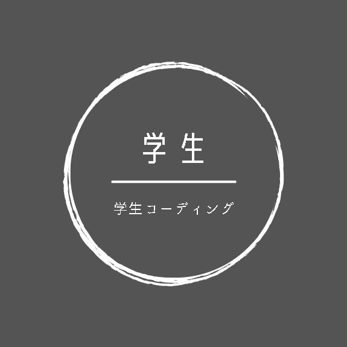

# ガッコソン No. 1

主催： Zelka, LabPixel, にぼし

---

# ガッコソンとは
学生コーディング主催のハッカソンです。 
「**競うより学ぶ**」をモットーに様々なアイディアを募集しています。 
第1回目の開催となります

---

# ハッカソンとは
> ハッカソンは、ハック(hack)とマラソン(marathon)を組み合わせた造語とされ、プログラマーや設計者などのソフトウェア開発の関係者が、 短期間に集中的に開発作業を行うイベントを指します。

https://www.nic.ad.jp/ja/basics/terms/hackathon.html

---

# テーマと競技説明

- テーマは競技開始とともに発表されます。 
テーマに関わるWebアプリを作成してください。
- 3人1チームです。
- 期間は１ヶ月です。
- 完成したプロダクトについてのプレゼン大会があります。 
プレゼンは20~30分を予定しています。

---

# タイムスケジュール

| 日時 | イベント |
|---|---|
| 2022/11/30 23:59 | 申込み締め切り |
| 2022/12/20 17:00 | チーム分け発表 |
| 2023/01/01 10:00 | テーマ発表、競技開始 |
| 2023/01/04 20:00 | KICK OFFセレモニー |
| 2023/01/30 22:00 | 競技終了、プレゼン大会準備開始 |
| 2023/01/05 10:00 | プレゼン大会、投票||

---

# KICK OFF セレモニー

KICK OFF セレモニーは参加者同士の交流を深めるために行います。 
内容は当日のお楽しみです。

---

# プレゼン大会、投票

- プロダクトに関してのプレゼンを20~30分程度でプレゼンしてください。どんな発表の仕方でも構いません。
- 評価したいプロダクトにチームで1票ずつ投票してください。 
票が一番多いプロダクトが優勝です！

---

# ルール
- 学生コーディングのルールに則ってください。
- 他のチームの妨害等はやめましょう

# 注意
- 途中で諦めないで下さい！
- セキュリティに注意してアプリを作ってください。

---

# 参考までに...

アイディアとしてこんなのはどうでしょうか！

## プロダクトの内容

マリオブラザーズ

## 機能

- ログイン機能がある。
- スコアボードで点数が表示される。
- 自分の好きなスキンをアップロードできる。

---

# 申込み

下記リンクから申込みを完了させて下さい。 
https://forms.gle/qwxFp4w9LHiPpBN38

- 1人での参加の場合はランダムにチームが組まれます。
- チームで参加の方は人数分の情報を記載してください。
1チームは3人で構成されます！

**Discordサーバー「学生コーディング」に入っていない方は、次のページを参考にして入ってください。**

---

# 学生コーディング

## 主催
- Zelka
- にぼし
- LabPixel

## Discordサーバー招待リンク

https://disboard.org/ja/server/974986650117607444
ご不明点がありましたら、Discordにてお知らせください。